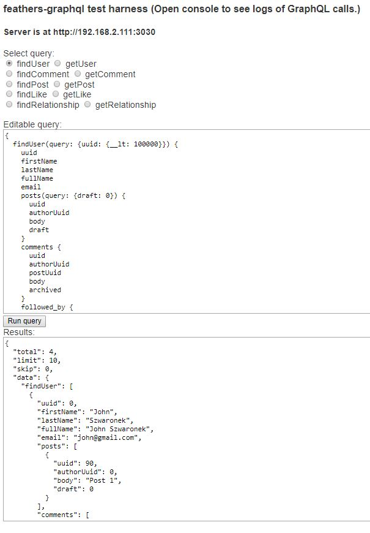
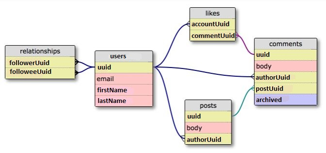
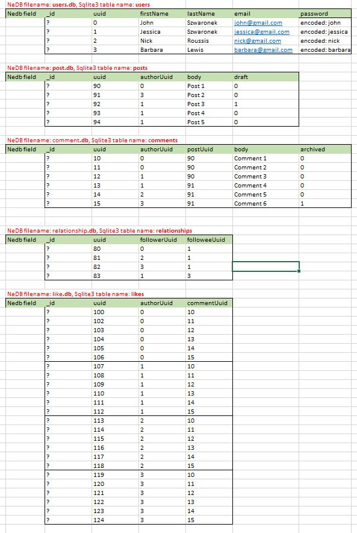

# GraphQL examples

> Several examples of using GraphQL with FeathersJS.

These GraphQL examples were generated using [@feathers-plus/cli](https://generator.feathers-plus.com/)
and [@feathers-plus/graphql](https://github.com/feathers-plus/graphql).

The GraphQL endpoints [interface seamlessly](https://generator.feathers-plus.com/guide/#graphql) with FeathersJS.

## Examples

There are 10 examples, each in its own folder. 

folder name | language | database | resolver functions
:-|:-|:-|:-|
js-nedb-services | JavaScript | NeDB | plain Feathers calls
js-nedb-batchloaders | JavaScript | NeDB | BatchLoader calls
js-sequelize-services | JavaScript | Sequelize + SQLite | plain Feathers calls
js-sequelize-batchloaders | JavaScript | Sequelize + SQLite | BatchLoader calls
js-sequelize-sql | JavaScript | Sequelize + SQLite | raw SQL statements
ts-nedb-services | TypeScript | NeDB | plain Feathers calls
ts-nedb-batchloaders | TypeScript | NeDB | BatchLoader calls
ts-sequelize-services | TypeScript | Sequelize + SQLite | plain Feathers calls
ts-sequelize-batchloaders | TypeScript | Sequelize + SQLite | BatchLoader calls
ts-sequelize-sql | TypeScript | Sequelize + SQLite | raw SQL statements

## Installation

1. Make sure you have [NodeJS](https://nodejs.org/) and [npm](https://www.npmjs.com/) installed.

2. [Clone the repository](https://help.github.com/articles/cloning-a-repository/)
to create a local copy on your computer.

3. Change the directory to the example you want to run, e.g.
   ```text
   cd cli-generator-example/js-nedb-services
   ```
   
4. Install your dependencies
    ```
    npm install
    ``` 
    
5. Start the app
    ```
    npm start
    ```

The app will create the database
and then run a short async test to confirm it is functioning correctly.

## Starting the client test harness

Point your browser at `localhost:3030` and you will see this test harness:



You can run any of the 10 provided queries.
The query appears in the editable window on top.
The result (or error message) appears in the bottom window after you click `Run query`.

You can modify any of those queries before running them.

> You can also [use GraphiQL as an interface](https://generator.feathers-plus.com/guide/#using-graphiql)
to the examples.

### Keywords

The GraphQL types `findUser` and `posts` in the example above allow keywords.
The `comments` and `followed_by` types do not.

The example apps show how to implement FeathersJS-like keywords,
as you can see in the example above.
The apps support these keywords:
- **key**: The same as Feathers `id`, numeric or string.
- **query**: The same as Feathers `params.query`.
- **params**: The same as Feathers `params`.

The FeathersJS API provides a great deal of flexibility which is now available to your queries.
Using it in GraphQL queries also results in a conflict-free interface.

> You are not required to use the FeathersJS API.
> You control what keywords are allowed and how the resolvers use them.

`$` is a reserved character in GraphQL, so Feathers props such as `$sort` and `$in` will result in GraphQL errors.
You can instead use a double underscore `__` where ever you would use a `$` with Feathers. 

> There is more information in the [docs](https://generator.feathers-plus.com/get-started/#our-app-as-an-example).

### Authentication

The client will authenticate with the server before enabling the `Run query` button.

Internally, the `users` service also requires authentication, the others do not.
The apps show how you can pass along your GraphQL authentication when calling other services.

> There is some more information in the [docs](https://generator.feathers-plus.com/guide/#authentication)

## Database

This apps use either an NeDB or SQLite database, both of which reside in `./data`.

Both databases have the same structure:



and contain the same data:



> We use `uuid` fields as foreign keys for table relations
> to avoid the differences involving primary keys in different databases.
> You, of course, are likely to use the primary key for the relations.

## Ten examples

This repo contains several example FeathersJS applications using GraphQL Query
via the feathers-plus/graphql adapter.
The examples all use the same data set,
and the same frontend client for testing.

> Each example is available in both JavaScript and TypeScript.

The examples differ in the database being used and in how the Query is resolved.
We've chosen representative databases which require no installation.

### non-SQL DB

Two examples use the [NeDB](https://github.com/louischatriot/nedb) database.
They differ in how they resolve the GraphQL query:
- Feathers services only are used in examples js-nedb-service and ts-nedb-services.
- Feathers services with [batch-loaders](https://feathers-plus.github.io/v1/batch-loader/)
are used in examples js-nedb-batchloaders and ts-nedb-batchloaders.

These examples will work without any GraphQL related changes for
[MongoDB](https://www.mongodb.com/) and [Mongoose](http://mongoosejs.com/).

### SQL DB

The [Sequelize](http://docs.sequelizejs.com/) ORM supports multiple SQL databases.
Three examples use it with the [SQLite](https://sqlite.org/cli.html) database.
They also differ in how they resolve the GraphQL query:
- Feathers services only are used in examples js-sequelize-service and ts-sequelize-services.
- Feathers services with [batch-loaders](https://feathers-plus.github.io/v1/batch-loader/)
are used in examples js-sequelize-batchloaders and ts-sequelize-batchloaders.
- Raw SQL statements are generated in examples js-sequelize-sql and ts-sequelize-sql.

These examples will work without any GraphQL related changes for
PostgreSQL, MySQL, and MSSQL.
They would also work with the [Knex](https://github.com/kripod/knex-orm) ORM.

### Different GraphQL resolvers

The 5 examples differ in how they implement their GraphQL resolvers.

#### FeathersJS services alone

When FeathersJS services alone are used, each resolver makes its own service call.
This is the simplest way to set up resolvers,
but it also generates the most service calls.

#### FeathersJS services are used with batch-loaders

A cache is automatically created for each resolver when
FeathersJS services are used with [batch-loaders](https://feathers-plus.github.io/v1/batch-loader/).
The same record is only read once.

The resolver requests are also batched.
Just one service call is made for several resolver calls.

Batch-loaders may also be shared among resolvers.
The same batch-loader, for example, may be used by resolvers needing the Users table.
This further reduces the number of service calls as one cache is shared,
and service calls for different resolvers may be satisfied together in one service call.

It is more complex to set up batch-loader resolvers than ones using just FeathersJS services.

> Batch-loaders typically reduce the number of service calls by a factor of 10,
> e.g. 2 calls instead of 20.

#### Using raw SQL statements

[Join-monster](https://join-monster.readthedocs.io/en/latest/)
is a query planner between GraphQL and SQL for the Node.js graphql-js reference implementation.
It's a function that takes a GraphQL query and dynamically translates GraphQL to SQL for efficient,
batched data retrieval before resolution.
It fetches only the data you need - nothing more, nothing less.

Setting up resolvers for `join-monster` is more complex than the previous 2 methods.
The results will be significantly faster than using FeathersJS services alone.
The results may be usefully faster than using batch-loaders,
depending on the Query and on the data set.

Although we can resolve any GraphQL query with a single round-trip to the database
by using one SQL statement, the queries generated can be very expensive. 
The [Join-monster](https://join-monster.readthedocs.io/en/latest/) documentation
explains how to effectively
[handle these situations](https://join-monster.readthedocs.io/en/latest/query-planning/).

> The example apps and the join-monster documentation use the same database schema,
> so switching between the 2 sets of documents is seamless.

## License

Copyright (c) 2018

Licensed under the [MIT license](LICENSE).
